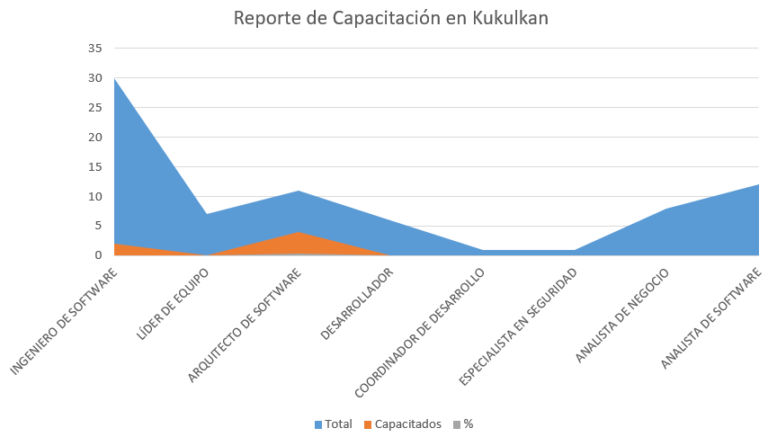
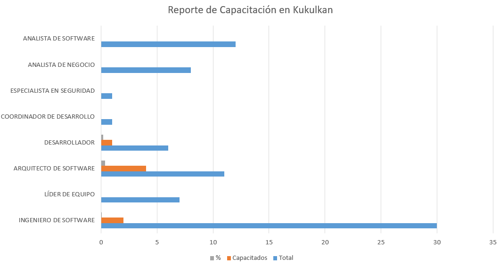

# Objetivo
Desarrollar la capacidad interna de la DADS, en el uso de la herramienta de kukulkan

# Corte al:
Julio 17 del 2018

# Resumen de Capacitación

|               ROL               |  # | Capacitados | 2018-07-16 |
|:-------------------------------:|:--:|:-----------:|:----------:|
|    INGENIERO   DE SOFTWARE      | 30 |      2      |     7%     |
| LÍDER DE   EQUIPO               |  7 |      0      |     0%     |
| ARQUITECTO   DE SOFTWARE        | 11 |      4      |     36%    |
| DESARROLLADOR                   |  6 |      0      |     0%     |
|    COORDINADOR   DE DESARROLLO  |  1 |      0      |     0%     |
|    ESPECIALISTA   EN SEGURIDAD  |  1 |      0      |     0%     |
| ANALISTA   DE NEGOCIO           |  8 |      0      |     0%     |
| ANALISTA   DE SOFTWARE          | 12 |      0      |     0%     |

